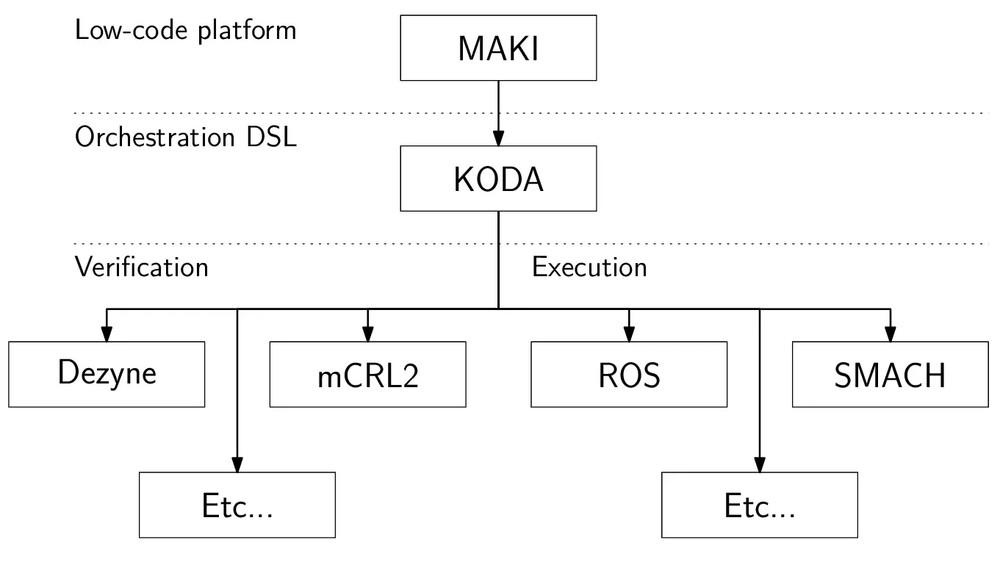
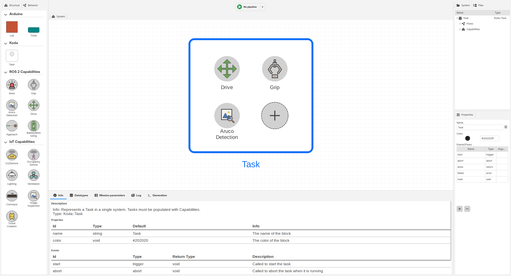
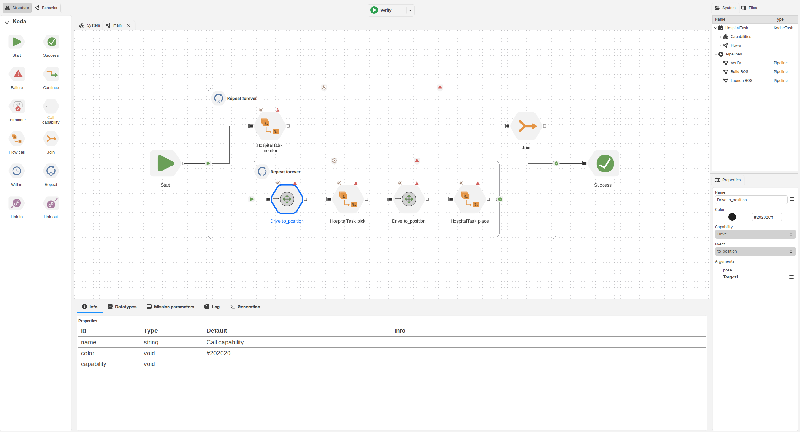
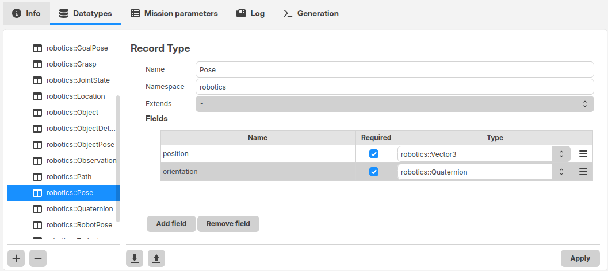
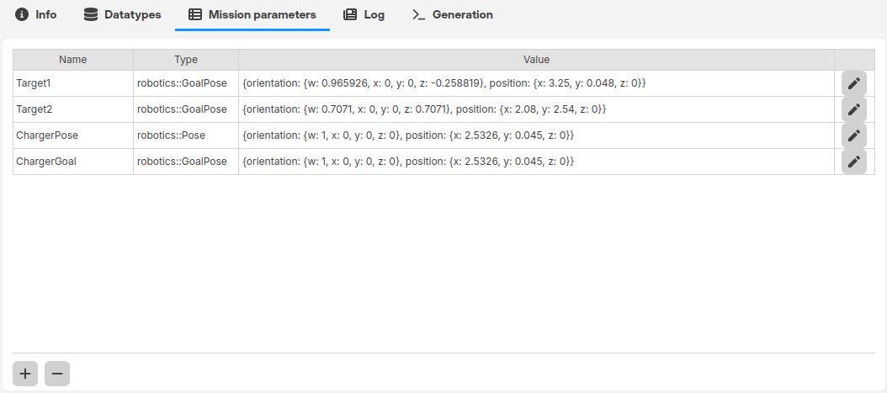
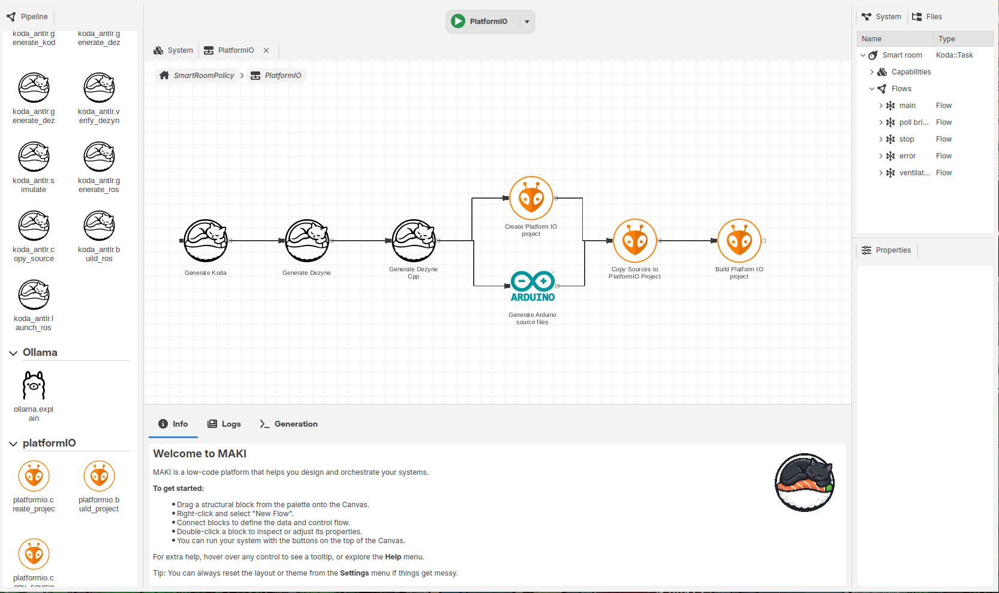

# MAKI


[](https://github.com/FelipeACXavier/maki/actions/workflows/build-dev-image.yaml)
[](https://github.com/FelipeACXavier/maki/actions/workflows/ci.yml)

MAKI is an open-source low-code development platform for designing, orchestrating, generating, and formally verifying ROS 2 robotic systems. It provides graphical modelling tools built around the [KODA domain-specific language (DSL)](https://github.com/FelipeACXavier/KODA), with support for capability-based robot architectures, behavioural and data modelling, code generation, and formal verification.

MAKI is developed as part of research into model-driven engineering, low-code development, software architecture, and formal methods for robotics.

For more information, see the [MAKI documentation](https://felipeacxavier.github.io/maki/).

## Overview

Developing a robotic application requires reasoning about several interconnected concerns: what functionality a robot provides, how that functionality is composed into tasks, what information is exchanged between components, and whether the resulting behaviour satisfies its requirements.

MAKI separates these concerns into dedicated graphical views while keeping them connected through a common underlying model. This allows developers to work at the level of robot capabilities and application behaviour rather than directly composing ROS 2 nodes, topics, services, and actions.

At the core of MAKI is [KODA](https://github.com/FelipeACXavier/KODA), a domain-specific language for describing robotic systems independently of a particular execution or verification backend. Models created visually in MAKI are represented using the same concepts provided by KODA and can be transformed into executable or formally verifiable artefacts.

The platform currently focuses on:

- **Capability-based modelling** of robotic functionality and its interfaces
- **Task modelling** for composing reusable capabilities into application-level functionality
- **Behavioural modelling** using compositional orchestration constructs such as sequences, parallel execution, repetition, time-bounded execution, and error handling
- **Data modelling** for explicitly representing the information produced and consumed by capabilities and tasks
- **Static analysis** of relationships between structural, behavioural, and data models
- **Extensible code generation** through configurable generation pipelines and backend plugins
- **ROS 2 integration** for generating and executing robotic applications
- **Formal verification** of application behaviour and user-defined properties

<p align="center">
  
</p>

## Different concerns, different views

### Structure and capabilities

MAKI models robotic functionality through **capabilities**. A capability defines an interface to functionality provided by the robotic system, such as navigation, object detection, manipulation, or battery monitoring.

Tasks declare the capabilities they require. This separates application behaviour from the concrete components that provide it and enables capabilities to be reused across tasks and robotic platforms.

<p align="center">
  
</p>

### Behaviour and orchestration

The behaviour of a task is described through **flows**. Flows visually compose capability calls and other flows using the orchestration constructs provided by KODA.

Simple behaviours can be expressed as sequences of operations, while more complex flows can introduce concurrency, synchronization, repetition, time constraints, and explicit handling of errors and aborts.

<p align="center">
  
</p>

Because composite flows follow the same behavioural interface as individual operations, complex behaviours can be constructed hierarchically from smaller reusable behaviours.

### Data and information

Robotic behaviour often depends not only on which operations execute, but also on the information they produce and consume.

MAKI therefore models data as an explicit part of the application architecture. Capabilities can declare the information they produce and consume, while tasks can define parameters and project-specific data types.

Making these relationships explicit allows MAKI to detect inconsistencies across modelling concerns and provides the editor with additional information for assisting users when constructing application behaviour.

<table>
  <tr>
    <td width="50%" align="center">
      <br>
      <em>Data types</em>
    </td>
    <td width="50%" align="center">
      <br>
      <em>Mission parameters</em>
    </td>
  </tr>
</table>

## From models to robotic applications

MAKI separates application modelling from the technologies used to execute or analyse the resulting system.

KODA models are compiled into an intermediate representation that can be consumed by different backend plugins. A backend may generate executable robotic software, translate the model into a formal verification language, or produce other application artefacts.

This separation allows the same application model to be used for multiple purposes without exposing backend-specific details in the graphical models.

### Modular generation

MAKI supports plugins that provide **generation actions**. Individual actions can perform tasks such as generating source code, compiling an application, running verification, or deploying generated artefacts.

Generation actions can themselves be composed into visual pipelines. This makes it possible to define complete workflows while keeping individual generators independent and reusable.

<p align="center">
  
</p>

## Verification

MAKI is designed to support verification throughout the development process rather than treating it as a separate activity performed after implementation.

KODA models provide an abstraction of application behaviour that can be translated to formal verification backends. Developers can additionally define behavioural properties describing requirements that should hold for the resulting application.

This allows properties to be checked against the same application model used for code generation while keeping the details of the underlying verification technology hidden from the modeller.

See the [documentation](https://felipeacxavier.github.io/maki/) for more information about defining properties in KODA.

## Installation

To build and install MAKI:

1. Clone this repository and move into it:

   ```bash
   git clone https://github.com/FelipeACXavier/maki.git
   cd maki
   ```

2. Clone the submodules:

   ```bash
   git submodule update --init --recursive
   ```

3. Follow the OS-specific build instructions:

   - [Linux](./docs/Building/build_linux.md)
   - [Windows](./docs/Building/build_windows.md)

## Examples

Example applications are available in the [`examples`](./examples/) directory and can be loaded directly into MAKI. Each example also includes its generated KODA representation for those interested in the textual DSL.

More information is available in the [MAKI documentation](https://felipeacxavier.github.io/maki/) and the [KODA repository](https://github.com/FelipeACXavier/KODA).

## Publications

- [Verification-Centered Low-Code for Autonomous Robots: A Contract-Based Reference Architecture Approach](https://doi.org/10.1145/3786179.3788321)
- [From Robotic to IoT Systems: Exploring the Reuse of a Robotic Orchestration DSL in the IoT domain](https://doi.org/10.1145/3786159.3788475)
- [Towards Semantic Interoperability in Digital Twins: An Ontology-Based Approach](https://doi.org/10.1109/ICSA-C68850.2026.00050)
- [Constraining Behavioural Modelling to Enable Model-Based Verification](https://doi.org/10.1145/3837062.3839050)

## Documentation

The full [MAKI documentation](https://felipeacxavier.github.io/maki/) covers:

- Architecture and design of the MAKI platform
- Building MAKI from source
- Configuration and customization
- Example robotic applications modelled using MAKI and KODA
- The KODA modelling language, its concepts, and its notation

## Contributing

MAKI is open-source and under active development. Contributions, bug reports, and feature suggestions are welcome through the [MAKI GitHub repository](https://github.com/FelipeACXavier/maki).
